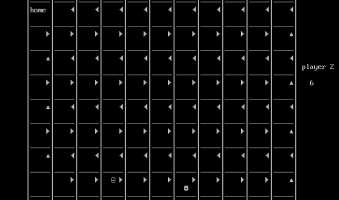
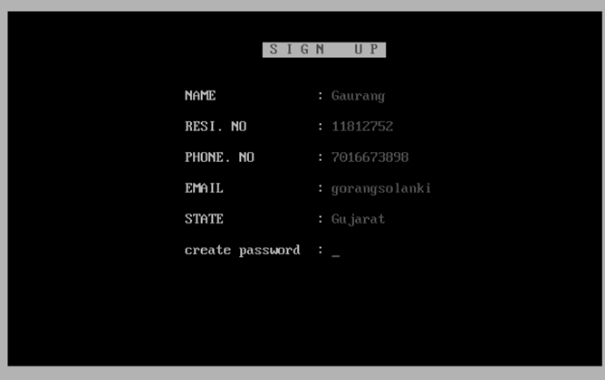
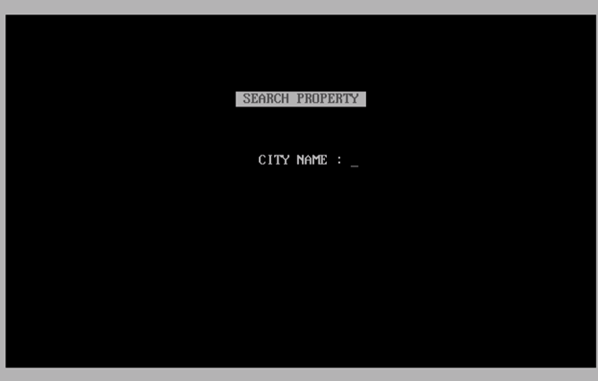

# College Year 1 Games and Projects

Hey there! This repo holds some games/projects I whipped up during my first year of college.

## Game Glimpse

### Amazing_T3

Ever played tic-tac-toe and thought, "This needs more pizzazz!"? No? Well, I did. Check out Amazing_T3 – it's got ASCII vibes to make it way cooler.

***

### CatchThem

Picture this: prison break, chaos, and you – a cop rounding up escaped prisoners. Score? Based on how many baddies you catch.

### Lost_In_Maze

Just a game of finding your buddy in a maze. Simple, yet surprisingly tricky.

### NoSnakes_NoLadder

Classic Snake and Ladder, but sans snakes and ladders. Just roll the dice, race your pals home – easy peasy.

### RealEstate

I dabbled in real estate too. Sign up, log in, and start house-hunting. I sprinkled some ASCII magic for that extra flair. Also, Facilitate data entry on other program, utilizing ifstream for efficient data file handling. Note that the data utilized is entirely fictional.

